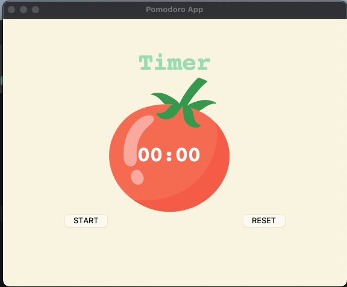

# Pomodoro App

This is a Pomodoro App built using Python and Tkinter. The Pomodoro Technique is a time management method that uses a timer to break down work into intervals, traditionally 25 minutes in length, separated by short breaks.

## Description

The Pomodoro App allows users to start a timer for work sessions, short breaks, and long breaks. It displays the remaining time in minutes and seconds and provides visual cues for different types of intervals. Users can also track their work sessions with checkmarks displayed on the interface.

## Features

- Start, pause, and reset timer functionality
- Customizable work session, short break, and long break durations
- Visual cues for different types of intervals (work, short break, long break)
- Checkmark tracking of completed work sessions
- Simple and intuitive user interface

## Usage

1. Click the "START" button to begin the timer.
2. The timer will display the remaining time for the current session (work, short break, or long break).
3. Once the session ends, the timer will automatically switch to the next type of interval.
4. Use the "RESET" button to stop the timer and reset it to the initial state.

## Requirements

- Python 3.x
- Tkinter library
